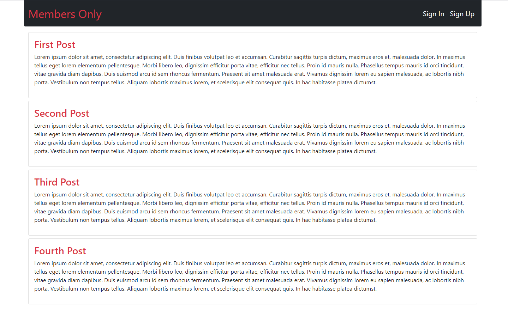
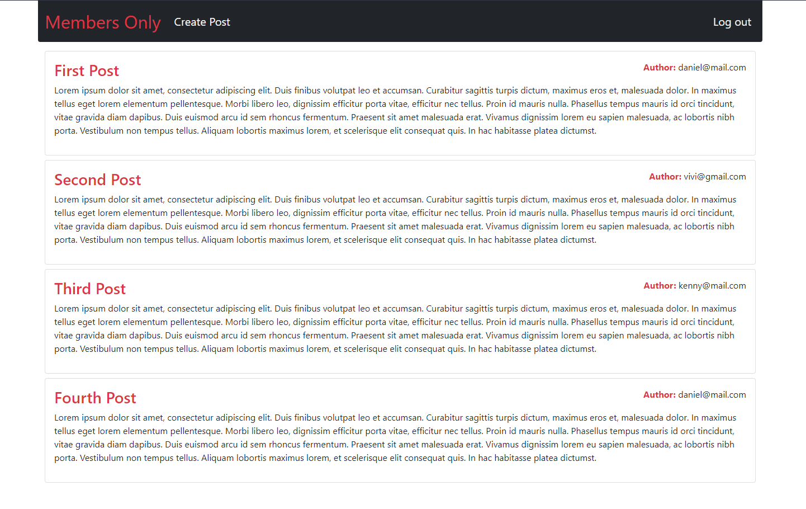
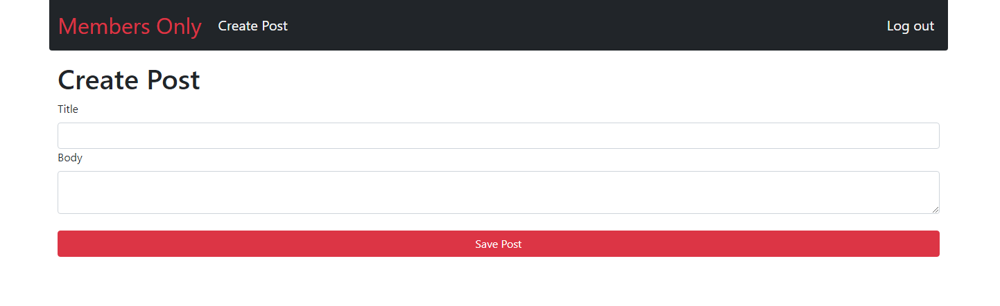

# Members Only 
 

> This project is developed as part of the Microverse curriculum, to be more specific, is part of the Ruby on Rails module.
> 
> It consists in a web application where members can post their secrets.

## Index



>This is the main page, where are listed all the posts, notice that the author is not visible, you must login to know the author.

## Index whit loged User


> Is pretty much the same than Index but you can see the author of each post. Also you can create a post and log out.

## Create Post


> This page allows the user to create a post.

### 👷🏻 Built using
    - Ruby
    - Ruby On Rails
    - Rubocop
    - SQLite3
    - Github
    - RubyMine
    - CSS3

## Getting Started

To get a local copy up and running follow these simple example steps.

### ✅ Prerequisites

* Make sure that **Ruby Environment** is installed in your computer (try to run _ruby_ from your prompt), if not you can install it from [here.](https://www.ruby-lang.org/en/downloads/)

* [Download](https://github.com/kensayo/members-only/archive/refs/heads/development.zip) and unzip **or** [clone this repository](https://docs.github.com/es/github/creating-cloning-and-archiving-repositories/cloning-a-repository)


### 👨🏻‍🔧 Setup

- Open your terminal and move to the root of the project, using ```cd``` command.
- You must run ```$ bundle install```
- Then you must run ```$ rails db:migrate```, so you can work locally with the database.
- Start server using ```$ rails s```

### 🔌 Usage

- You can go to http://127.0.0.1:3000/ to use the app locally

## 👨🏻‍💻 Kenny Ortega

- GitHub: [kensayo](https://github.com/kensayo)
- Twitter: [@kensayo](https://twitter.com/kensayo)
- LinkedIn: [LinkedIn](https://www.linkedin.com/in/kennyortega/)


### Contributions and issues are welcome!

License
This project is MIT licensed.
